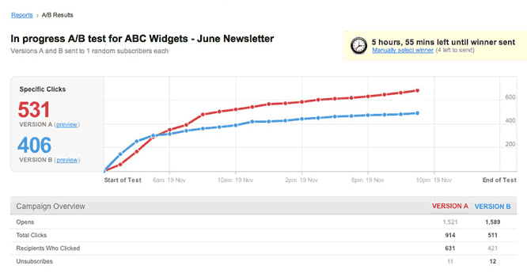
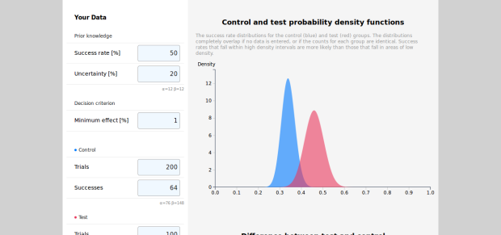

# kel89-BDAOrg
Repository for STSCI 4780 Bayesian Data Analysis

## About Me
My name is Kenneth Lipke, and I am currently finishing my M.Eng in ORIE with a concentration in Data Analytics. Before this, I was an undergraduate--here as well--majoring in math and economics.  

I am drawn to Bayesian statistics because I could never fully wrap my mind around the frequentist interpretation. For example, when you ask someone what they are planning on doing later, they may say there is a 50% chance they will go to the movies, and a 50% chance that they will go bowling. What does that mean? Are they telling me that if this *exact* day were repeated 10,000 times that 5,000 of them they would go to the movies, and the other 5,000 they would go bowling? No one thinks that way. It is common to hear one off events expressed in terms of probabilites, but I don't think the frequentist approach adequitely explains them. As a result, I want to learn more about the Bayesian approach, to find out if it is a more intuitive and understandable way to explain probability and statistics.

In terms of data analysis problems, I am most interested in using statistical techniques to explain rather than predict. In terms of interesting analysis problems that are relevant to this class, the firs that comes to mind is one I encoutered at a previous internship. Last Summer I interned as a data analyst at Lucid Software (they make cloud based charting software), and they were constantly running AB tests on new features. They used software that employed a frequentist approach, and had an output similar to the following:

This sort of output is very dangerous, as it often leads to "calling a winner" far too early. Before running the test, we would check parameters for statistical power, determine how long we would have to let the test run before we would be able to declare a winner at a certain confidence level. However, it is very challenging to refrain from calling a winner early when one line climbs rapidly above the other. A better approach that I explored over the summer was Bayesian AB testing, where the output would look more like this: 

Instead of having two lines over time, we get distributions that change over time. Here we see that the red has a higher mean, but a greater variance. This makes determining confidence in a conclusion more visual, and much easier to explain. 

This is just one example of an analysis problem that interests me, and I feel can be improved by Bayesian analysis. 
